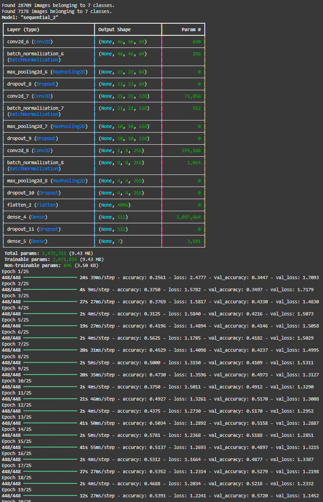
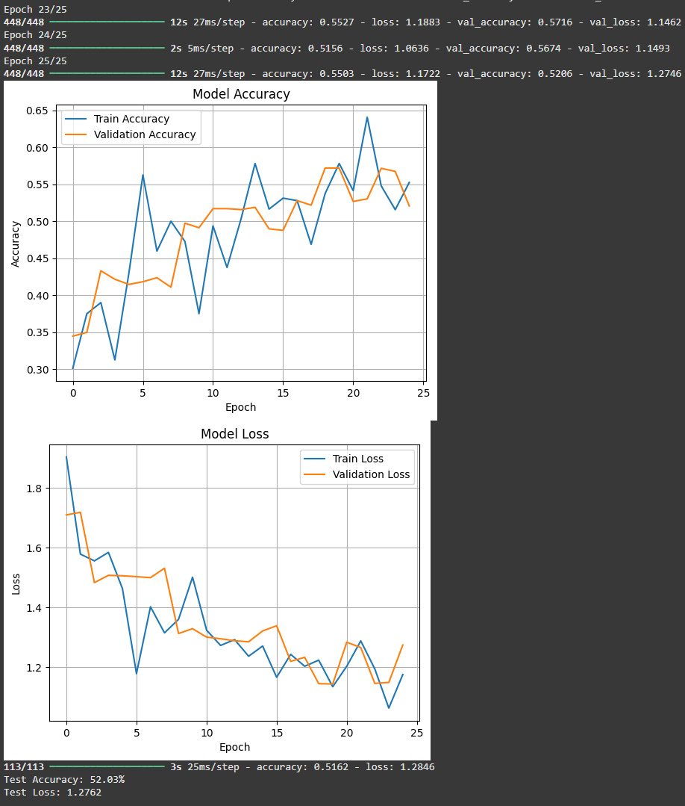

# 😄 Emotion Classifier using Deep Learning

This project uses a Convolutional Neural Network (CNN) to classify human facial emotions based on the FER2013 dataset. It detects emotions like Happy, Sad, Angry, Surprise, and more — directly from grayscale face images.

---

## 📷 Sample Output

### ▶️ Emotion Detection Results
Here are some examples of predictions made by the trained model:

 

> ✅ Add your own screenshots in the `screenshots/` folder for better visuals!

---

## 📁 Dataset

- **Source:** [FER2013 (Facial Expression Recognition)](https://www.kaggle.com/datasets/msambare/fer2013)
- 48x48 grayscale images of faces
- Emotions:
  - Angry
  - Disgust
  - Fear
  - Happy
  - Sad
  - Surprise
  - Neutral

---

## 🧠 Model Architecture

- Input: 48x48 grayscale image
- Layers:
  - Conv2D → ReLU → MaxPooling
  - Dropout for regularization
  - Dense → Softmax (multi-class classification)
- **Optimizer:** Adam  
- **Loss Function:** Categorical Crossentropy

---

## 📊 Training Results

| Metric     | Value          |
|------------|----------------|
| Accuracy   | XX% (fill yours) |
| Loss       | XX             |
| Epochs     | 30             |
| Batch Size | 64             |

---

## 📂 Files

| File                          | Description                                      |
|-------------------------------|--------------------------------------------------|
| `Emotion_Classifier.ipynb`    | Complete training notebook (Google Colab)        |
| `emotion_classifier_model.h5` | Trained Keras model                              |
| `screenshots/`                | Folder for output screenshots                    |
| `README.md`                   | Project overview and documentation               |

---

## 🚀 Future Plans

- Deploy using **Streamlit**
- Integrate with **OpenCV** for real-time webcam emotion detection
- Improve accuracy with **data augmentation** and **ResNet**

---

## 🧑‍💻 Author

**Muhammad Rayan Shahid**  
Passionate AI & ML Developer | [LinkedIn](https://www.linkedin.com/in/muhammadrayanshahid/) | [GitHub](https://github.com/RayanAIX)

---

⭐ If you found this project helpful, consider starring the repo!
